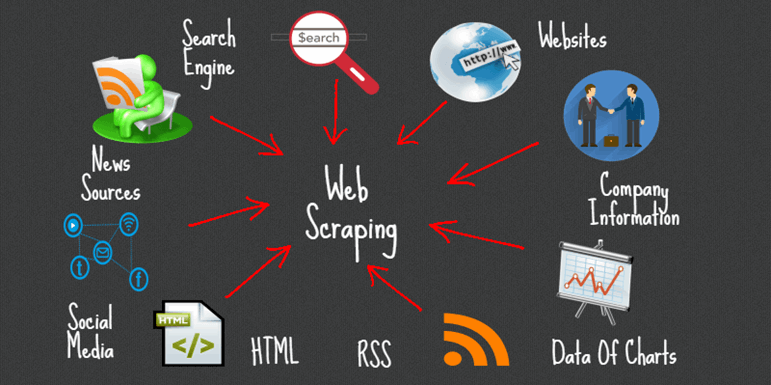
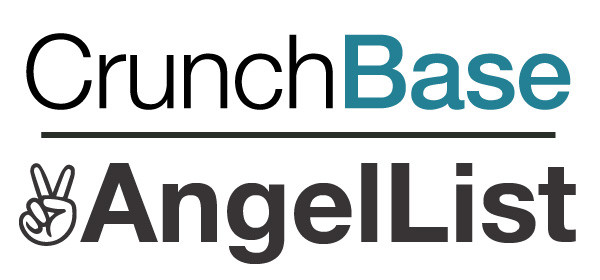

# Scraping Startups' Data from AngelList and Crunchbase
Websites are an ocean of limitless information which anyone and everyone can access. However, the amount of existing data available, and the increase of data in petabytes makes it a mammoth task for enterprises to get hold of accurate data & right insights beneficial to the company. Convenient access to the digital world and penetration of social media has increased data influx, but progressive businesses can stay ahead only with help of web scraping.

Some of the benefits of web scraping to organizations across industries are as follow
- Industry Research 
- Emerging Markets Analysis 
- Conduct Competitor Analysis 
- Determining Target Audience 
- Price optimization / Pricing Strategy Analysis 
- Brand Image Analysis 

I show, in this Repository, how to scrape [AngelList](https://angel.co/) and [Crunchbase](https://www.crunchbase.com/) to get valuable data about startups. 

Crunchbase is a platform for finding business information about private and public companies. Crunchbase information includes investments and funding information, founding members and individuals in leadership positions, mergers and acquisitions, news, and industry trends. I used the Crunchbase API, the free access one, to get the general information about companies registered on Crunchbase. I also showed how to scrape the Crunchbase profile page for a given company to get more information. To this end, you first need to let the class have your username and password to let it login through the app. This is because you cannot get access to the profile pages of companies without siging in. Again, this could be illegal, and you want to make sure that you already got permission to scrape companies profile pages via your app.

AngelList is a place that connects startups to investors and job candidates looking to work at startups. Their goal is to democratize the investment process, helping startups with both fundraising and talent. Scrapping AngleList is bit tricky. You first need to scrape the general information about companies from the ‘companies’ page by providing some search keywords, automatically click on the ‘More’ button, and so on. To avoid being blocked, you need to make the app sleep between scrapping two pages. Moreover, it doesn’t show more than 400 results per search. So, you need to filter out your search so that you can get as mush data as you can from your scraping. Then, to get more information about a company (information like fundraising rounds, social media pages, size, etc), you need to scrape its profile page on AngelList as well.

